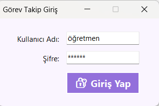
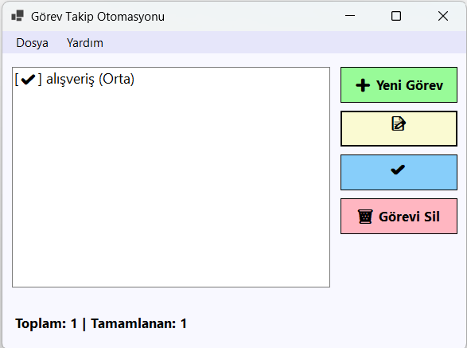
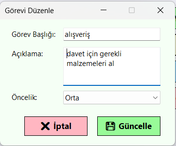

# Görev Takip Otomasyonu

Bu proje, öğrencilerin C# Windows Forms ve Nesneye Dayalı Programlama (OOP) mantığını anlamaları için geliştirilmiş basit bir görev (todo) yönetim uygulamasıdır.

## 🚀 Özellikler
- **Giriş Sistemi:** Kullanıcı adı ve şifre ile güvenli giriş (Örnek: `öğretmen` / `123456`).
- **Görev Yönetimi:** Görev ekleme, düzenleme, silme ve listeleme.
- **Durum Takibi:** Görevleri tamamlandı olarak işaretleme.
- **Öncelik Seviyeleri:** Görevlere düşük, orta veya yüksek öncelik atama.
- **Veri Saklama:** Görevlerin JSON formatında (`gorevler.json`) kalıcı olarak kaydedilmesi.

## 🛠️ Kullanılan Teknolojiler
- **Dil:** C#
- **Platform:** Windows Forms (.NET)
- **Veri Yapısı:** JSON (System.Text.Json)
- **Mimari:** Model-View-Controller (MVC) benzeri yapı.

## 📸 Uygulama Görüntüleri
### Kullanıcı Giriş Ekranı

### Ana Ekran

### Düzenleme Ekranı

## 📂 Kurulum ve Çalıştırma
1. Visual Studio projesini (`.sln`) açın.
2. `F5` tuşuna basarak projeyi derleyin ve çalıştırın.
3. Giriş bilgilerini kullanarak uygulamaya erişin.
